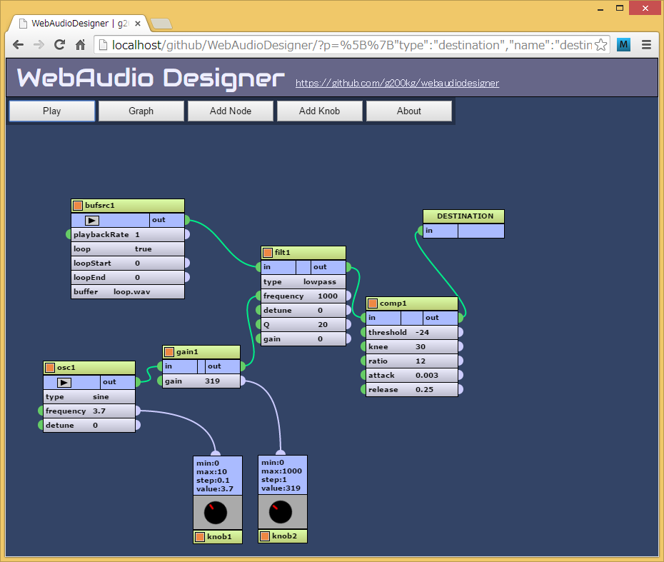

WebAudioDesigner
================

WebAudioAPI GUI design tool

Available at :
[https://g200kg.github.io/WebAudioDesigner](https://g200kg.github.io/WebAudioDesigner)

## Usage
#### Menu

Menu                              |Description
---                               |---
Play                              |Start all Oscillators and BufferSources
Graph - New Graph                 |Clear current graph
Graph - Export as JavaScript file |Export as simple JavaScript code
Graph - Link to this graph        |Display a URL that contain current graph
Add Node - (Node type)            |Add specified node
Add Knob                          |Add knobs that controls parameter values
About                             |Display info

#### Adding node
Select from menu "Add Node".

#### Adding knob
Select from menu "Add Knob".

#### Deleting node or knob
Select node/knob's pop-up menu "Delete" that will be appear when clicking node's upper left or knob's lower left corner orange square.

#### Make Connection
There are two types of connection, signals (green) and knob to parameter controls (light blue).
Connections are made with dragging between appropreate connectors that are represented as semi-circles.

Signals : 
* connect "out" to "in".
* or connect "out" to parameters (AudioParam) that has green connectors.

Controls :
* knobs to number type parameters that has light-blue connectors.

#### Delete Connection
* Click each connector, then select "Disconnection" from popup menu.
* Click node's popup menu (orange square) and select "Disconnect". This will disconnect all connection from this node.

## Sample patch

[Delay](http://g200kg.github.io/WebAudioDesigner/?b=W3tuOiJkZXN0aW5hdGlvbiIseDo2OTQseToxMTYsbW9kZTowLHZlcjoxLFc6ODAwLEg6NjAwfSx7bjoiZ2FpbjEiLHg6NTcyLHk6MTk5LGM6WyJkZXN0aW5hdGlvbiJdfSx7bjoiYnVmc3JjMSIseDo2NSx5OjE3MixwOntsb29wOnRydWUsYnVmZmVyOiJsb29wLndhdiJ9LGM6WyJkZWxheTEiLCJnYWluMSJdfSx7bjoiZGVsYXkxIix4OjMxNCx5OjMxMSxwOntkZWxheVRpbWU6MC4yNX0sYzpbImdhaW4yIiwiZ2FpbjMiXX0se246ImdhaW4yIix4OjQ4OCx5OjM4NCxwOntnYWluOjAuNX0sYzpbImdhaW4xIl19LHtuOiJnYWluMyIseDoyOTkseTo0NjMscDp7Z2FpbjowLjV9LGM6WyJkZWxheTEiXX1d)

[Chorus](http://g200kg.github.io/WebAudioDesigner/?b=W3tuOiJkZXN0aW5hdGlvbiIseDo2OTQseToxMTYsbW9kZTowLHZlcjoxLFc6ODAwLEg6NjAwfSx7bjoiZ2FpbjEiLHg6NTA5LHk6MTQwLGM6WyJkZXN0aW5hdGlvbiJdfSx7bjoiYnVmc3JjMSIseDo2NSx5OjE3MixwOntsb29wOnRydWUsYnVmZmVyOiJsb29wLndhdiJ9LGM6WyJkZWxheTEiLCJnYWluMSJdfSx7bjoiZGVsYXkxIix4OjM2NSx5OjI0NyxwOntkZWxheVRpbWU6MC4wMn0sYzpbImdhaW4xIl19LHtuOiJnYWluMyIseDoyNzAseTo0MTIscDp7Z2FpbjowLjAwMn0sYzpbImRlbGF5MS5kZWxheVRpbWUiXX0se246Im9zYzEiLHg6OTkseTozNDUscDp7ZnJlcXVlbmN5OjEuNX0sYzpbImdhaW4zIl19XQ)

[Phaser](http://g200kg.github.io/WebAudioDesigner/?b=W3tuOiJkZXN0aW5hdGlvbiIseDo5NjIseToxMzksbW9kZTowLHZlcjoxLFc6ODAwLEg6NjAwfSx7bjoiZ2FpbjEiLHg6ODI1LHk6MTAxLGM6WyJkZXN0aW5hdGlvbiJdfSx7bjoiYnVmc3JjMSIseDo2OCx5Ojk3LHA6e2xvb3A6dHJ1ZSxidWZmZXI6Imxvb3Aud2F2In0sYzpbImZpbHQxIiwiZ2FpbjEiXX0se246Im9zYzEiLHg6NTIseTo0MzUscDp7ZnJlcXVlbmN5OjN9LGM6WyJnYWluMiJdfSx7bjoiZmlsdDEiLHg6MjY2LHk6Mjg1LHA6e3R5cGU6ImFsbHBhc3MiLGZyZXF1ZW5jeToxMDAwfSxjOlsiZmlsdDIiXX0se246ImZpbHQyIix4OjQyNix5OjI2MyxwOnt0eXBlOiJhbGxwYXNzIixmcmVxdWVuY3k6MTAwMH0sYzpbImZpbHQzIl19LHtuOiJnYWluMiIseDoyNjMseTo1NjEscDp7Z2Fpbjo1MDB9LGM6WyJmaWx0MS5mcmVxdWVuY3kiLCJmaWx0Mi5mcmVxdWVuY3kiLCJmaWx0My5mcmVxdWVuY3kiLCJmaWx0NC5mcmVxdWVuY3kiXX0se246ImZpbHQzIix4OjU4MSx5OjIzNyxwOnt0eXBlOiJhbGxwYXNzIixmcmVxdWVuY3k6MTAwMH0sYzpbImZpbHQ0Il19LHtuOiJmaWx0NCIseDo3MzUseToyMjEscDp7dHlwZToiYWxscGFzcyIsZnJlcXVlbmN5OjEwMDB9LGM6WyJnYWluMSJdfV0)

[FSU](http://g200kg.github.io/WebAudioDesigner/?b=W3tuOiJkZXN0aW5hdGlvbiIseDo1NjgseToyMDUsbW9kZTowLHZlcjoxLFc6ODAwLEg6NjAwfSx7bjoiYnVmc3JjMSIseDo4NSx5OjE3OCxwOntsb29wOnRydWUsYnVmZmVyOiJsb29wLndhdiJ9LGM6WyJkZWxheTEiXX0se246ImRlbGF5MSIseDozOTYseToxNTQsYzpbImRlc3RpbmF0aW9uIl19LHtuOiJvc2MxIix4OjgxLHk6MzkyLHA6e3R5cGU6InNhd3Rvb3RoIixmcmVxdWVuY3k6MC41fSxjOlsic2hhcGVyMSJdfSx7bjoic2hhcGVyMSIseDoyNzYseTozNDcscDp7Y3VydmU6Im5ldyBGbG9hdDMyQXJyYXkoW1xuXG4wLFxuMCxcbjAuMSxcbjAuMSxcbjAsXG4wLFxuMC4zLFxuMC4zLFxuMC4yLFxuMC4yLFxuMC40LFxuMC40LFxuMC4yLFxuMC4yLFxuXG5dKSJ9LGM6WyJkZWxheTEuZGVsYXlUaW1lIl19XQ)

[Wah with knob controls](http://g200kg.github.io/WebAudioDesigner/?b=W3tuOiJkZXN0aW5hdGlvbiIseDo1ODUseToxNTcsbW9kZTowLHZlcjoxLFc6ODAwLEg6NjAwfSx7bjoiYnVmc3JjMSIseDo5Mix5OjE0MixwOntsb29wOnRydWUsYnVmZmVyOiJsb29wLndhdiJ9LGM6WyJmaWx0MSJdfSx7bjoiZmlsdDEiLHg6MzU4LHk6MjA4LHA6e2ZyZXF1ZW5jeToxMDAwLFE6MjB9LGM6WyJjb21wMSJdfSx7bjoib3NjMSIseDo1Myx5OjM2OSxwOntmcmVxdWVuY3k6Mn0sYzpbImdhaW4xIl19LHtuOiJnYWluMSIseDoyMjAseTozNDcscDp7Z2Fpbjo2MDZ9LGM6WyJmaWx0MS5mcmVxdWVuY3kiXX0se246ImNvbXAxIix4OjUwNSx5OjI3OSxjOlsiZGVzdGluYXRpb24iXX0se246Imtub2IxIix4OjI2Myx5OjUwMixwOnttaW46MC4xLG1heDoyMCxzdGVwOjAuMSx2YWw6Mn0sYzpbIm9zYzEuZnJlcXVlbmN5Il19LHtuOiJrbm9iMiIseDozNTQseTo1MDEscDp7bWF4OjgwMCx2YWw6NjA2fSxjOlsiZ2FpbjEuZ2FpbiJdfV0)

[AutoPan with knob controls](http://g200kg.github.io/WebAudioDesigner/?b=W3tuOiJkZXN0aW5hdGlvbiIseDo3MDgseToxMTUsbW9kZTowLHZlcjoxLFc6ODAwLEg6NjAwfSx7bjoiYnVmc3JjMSIseDo0OCx5OjExNCxwOntsb29wOnRydWUsYnVmZmVyOiJsb29wLndhdiJ9LGM6WyJzcGxpdDEiXX0se246InNwbGl0MSIseDoyNDUseToyMDIsYzpbImdhaW4xIix7dDoiZ2FpbjIiLG86MX1dfSx7bjoiZ2FpbjEiLHg6NDQ2LHk6MTY5LHA6e2dhaW46MC41fSxjOlsibWVyZ2UxIl19LHtuOiJnYWluMiIseDo0NDUseToyNTIscDp7Z2FpbjowLjV9LGM6W3t0OiJtZXJnZTEiLGk6MX1dfSx7bjoibWVyZ2UxIix4OjU5NSx5OjIwMSxjOlsiZGVzdGluYXRpb24iXX0se246Im9zYzEiLHg6NzUseTozNDAscDp7ZnJlcXVlbmN5OjMuMX0sYzpbImdhaW40IiwiZ2FpbjMiXX0se246ImdhaW4zIix4OjIzOCx5OjI5NCxwOntnYWluOi0wLjV9LGM6WyJnYWluMS5nYWluIl19LHtuOiJnYWluNCIseDoyNDAseTozODIscDp7Z2FpbjowLjV9LGM6WyJnYWluMi5nYWluIl19LHtuOiJrbm9iMSIseDoxNjQseTo0OTkscDp7bWF4OjEwLHN0ZXA6MC4xLHZhbDozLjF9LGM6WyJvc2MxLmZyZXF1ZW5jeSJdfV0)

[MediaElementSource and Tone Control](http://g200kg.github.io/WebAudioDesigner/?b=W3tuOiJkZXN0aW5hdGlvbiIseDo2MDEseTo0OSxtb2RlOjAsdmVyOjEsVzo4MDAsSDo2MDB9LHtuOiJlbGVtc3JjMSIseDo5LHk6NzIscDp7dXJsOiJzYW1wbGVzL2tlcm9rZXJvc2hpeW91eW8ubXAzIn0sYzpbImZpbHQxIl19LHtuOiJrbm9iMSIseDoyMjAseTozMjIscDp7bWluOi0yNCxtYXg6MjQsdmFsOi02fSxjOlsiZmlsdDEuZ2FpbiJdfSx7bjoia25vYjIiLHg6MzUyLHk6MzIxLHA6e21pbjotMjQsbWF4OjI0fSxjOlsiZmlsdDIuZ2FpbiJdfSx7bjoiZmlsdDEiLHg6MTAxLHk6MTcwLHA6e3R5cGU6Imxvd3NoZWxmIixmcmVxdWVuY3k6MjAwLGdhaW46LTZ9LGM6WyJmaWx0MiJdfSx7bjoiZmlsdDIiLHg6MjUxLHk6MTQzLHA6e3R5cGU6InBlYWtpbmciLGZyZXF1ZW5jeToxMDAwLFE6MC41fSxjOlsiZmlsdDMiXX0se246ImZpbHQzIix4OjQwNix5OjEyNixwOnt0eXBlOiJoaWdoc2hlbGYiLGZyZXF1ZW5jeTo1MDAwfSxjOlsiY29tcDEiXX0se246Imtub2IzIix4OjQ4MCx5OjMyMCxwOnttaW46LTI0LG1heDoyNH0sYzpbImZpbHQzLmdhaW4iXX0se246ImNvbXAxIix4OjU3MCx5OjEwOCxjOlsiZGVzdGluYXRpb24iXX1d)

[Vocoder voice](http://g200kg.github.io/WebAudioDesigner/?b=W3tuOiJkZXN0aW5hdGlvbiIseDoxMDU1LHk6NDg1LG1vZGU6MCx2ZXI6MSxXOjgwMCxIOjYwMH0se246ImJ1ZnNyYzEiLHg6MjgseTo2OSxwOntsb29wOnRydWUsYnVmZmVyOiJ2b2ljZS5tcDMifSxjOlsiZmlsdDEiLCJmaWx0MiIsImZpbHQzIiwiZmlsdDQiLCJmaWx0OSIsImZpbHQxMCJdfSx7bjoiZmlsdDEiLHg6MjM3LHk6NzQscDp7dHlwZToiYmFuZHBhc3MiLGZyZXF1ZW5jeToyMjAsUTo4fSxjOlsic2hhcGVyMSJdfSx7bjoiZmlsdDIiLHg6MjM2LHk6MTUzLHA6e3R5cGU6ImJhbmRwYXNzIixmcmVxdWVuY3k6NDQwLFE6OH0sYzpbInNoYXBlcjIiXX0se246ImZpbHQzIix4OjIzNyx5OjIzMyxwOnt0eXBlOiJiYW5kcGFzcyIsZnJlcXVlbmN5OjY2MCxROjh9LGM6WyJzaGFwZXIzIl19LHtuOiJmaWx0NCIseDoyMzcseTozMTMscDp7dHlwZToiYmFuZHBhc3MiLGZyZXF1ZW5jeTo4ODAsUTo4fSxjOlsic2hhcGVyNCJdfSx7bjoic2hhcGVyMSIseDo0MDAseTo3NCxwOntjdXJ2ZToibmV3IEZsb2F0MzJBcnJheShbXG4xLDAsMVxuXSkifSxjOlsiZmlsdDUiXX0se246InNoYXBlcjIiLHg6Mzk5LHk6MTU1LHA6e2N1cnZlOiJuZXcgRmxvYXQzMkFycmF5KFtcbjEsMCwxXG5dKSJ9LGM6WyJmaWx0NiJdfSx7bjoic2hhcGVyMyIseDo0MDEseToyMzMscDp7Y3VydmU6Im5ldyBGbG9hdDMyQXJyYXkoW1xuMSwwLDFcbl0pIn0sYzpbImZpbHQ3Il19LHtuOiJzaGFwZXI0Iix4OjQwMCx5OjMxMixwOntjdXJ2ZToibmV3IEZsb2F0MzJBcnJheShbXG4xLDAsMVxuXSkifSxjOlsiZmlsdDgiXX0se246ImZpbHQ1Iix4OjU4MSx5Ojc0LHA6e2ZyZXF1ZW5jeTo1MH0sYzpbImdhaW4xLmdhaW4iXX0se246ImZpbHQ2Iix4OjU4MSx5OjE1NSxwOntmcmVxdWVuY3k6NTB9LGM6WyJnYWluMi5nYWluIl19LHtuOiJmaWx0NyIseDo1ODEseToyMzcscDp7ZnJlcXVlbmN5OjUwfSxjOlsiZ2FpbjMuZ2FpbiJdfSx7bjoiZmlsdDgiLHg6NTgwLHk6MzE3LHA6e2ZyZXF1ZW5jeTo1MH0sYzpbImdhaW40LmdhaW4iXX0se246ImdhaW4xIix4Ojg3Nyx5OjMzNSxwOntnYWluOjB9LGM6WyJnYWluNyJdfSx7bjoiZ2FpbjIiLHg6ODc3LHk6MzgxLHA6e2dhaW46MH0sYzpbImdhaW43Il19LHtuOiJnYWluMyIseDo4ODIseTo0MjEscDp7Z2FpbjowfSxjOlsiZ2FpbjciXX0se246ImdhaW40Iix4Ojg3OCx5OjQ2MyxwOntnYWluOjB9LGM6WyJnYWluNyJdfSx7bjoib3NjMSIseDo3MzUseToyNSxwOntmcmVxdWVuY3k6MjIwfSxjOlsiZ2FpbjEiXX0se246Im9zYzIiLHg6NzM3LHk6MTMyLGM6WyJnYWluMiJdfSx7bjoib3NjMyIseDo5MDQseToyNyxwOntmcmVxdWVuY3k6NjYwfSxjOlsiZ2FpbjMiXX0se246Im9zYzQiLHg6OTA1LHk6MTM1LHA6e2ZyZXF1ZW5jeTo4ODB9LGM6WyJnYWluNCJdfSx7bjoiZmlsdDkiLHg6MjQwLHk6MzkwLHA6e3R5cGU6ImJhbmRwYXNzIixmcmVxdWVuY3k6MTEwMCxROjh9LGM6WyJzaGFwZXI1Il19LHtuOiJmaWx0MTAiLHg6MjM4LHk6NDY4LHA6e3R5cGU6ImJhbmRwYXNzIixmcmVxdWVuY3k6MTMyMCxROjh9LGM6WyJzaGFwZXI2Il19LHtuOiJzaGFwZXI1Iix4OjM5Nyx5OjM5NSxwOntjdXJ2ZToibmV3IEZsb2F0MzJBcnJheShbXG4xLDAsMVxuXSkifSxjOlsiZmlsdDEyIl19LHtuOiJzaGFwZXI2Iix4OjM5NCx5OjQ3MixwOntjdXJ2ZToibmV3IEZsb2F0MzJBcnJheShbXG4xLDAsMVxuXSkifSxjOlsiZmlsdDEzIl19LHtuOiJmaWx0MTIiLHg6NTgwLHk6NDAwLHA6e2ZyZXF1ZW5jeTo1MH0sYzpbImdhaW41LmdhaW4iXX0se246ImZpbHQxMyIseDo1ODMseTo0ODEscDp7ZnJlcXVlbmN5OjUwfSxjOlsiZ2FpbjYuZ2FpbiJdfSx7bjoiZ2FpbjUiLHg6ODc5LHk6NTAyLHA6e2dhaW46MH0sYzpbImdhaW43Il19LHtuOiJnYWluNiIseDo4ODAseTo1NTQscDp7Z2FpbjowfSxjOlsiZ2FpbjciXX0se246Im9zYzUiLHg6MTA2Mix5OjI0LHA6e2ZyZXF1ZW5jeToxMTAwfSxjOlsiZ2FpbjUiXX0se246Im9zYzYiLHg6MTA2NSx5OjEzNyxwOntmcmVxdWVuY3k6MTMyMH0sYzpbImdhaW42Il19LHtuOiJnYWluNyIseDoxMDU5LHk6Mzk0LHA6e2dhaW46NH0sYzpbImRlc3RpbmF0aW9uIl19XQ)

## License
Licensed under [MIT License](LICENSE) except Impulse Response files (included in samples/ir folder).  
Inpulse Response files are Licensed under [Voxengo's license](samples/ir/IMreverbs1/license.txt).  
